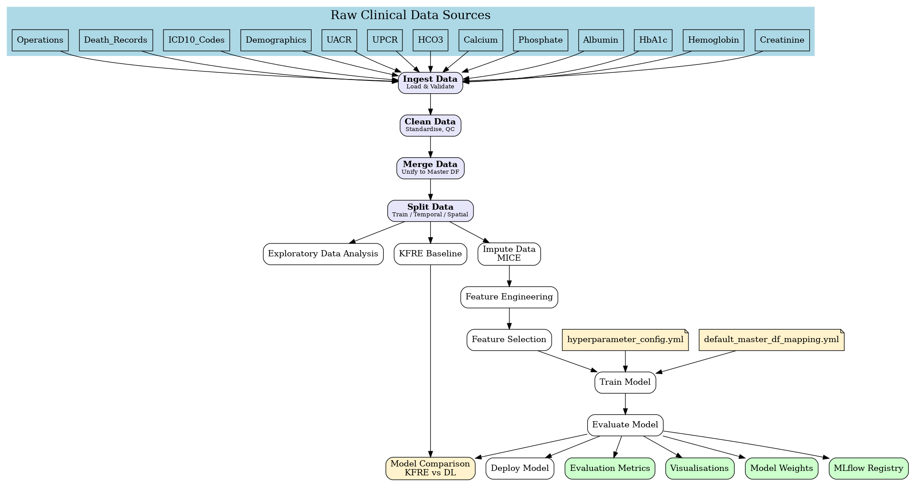
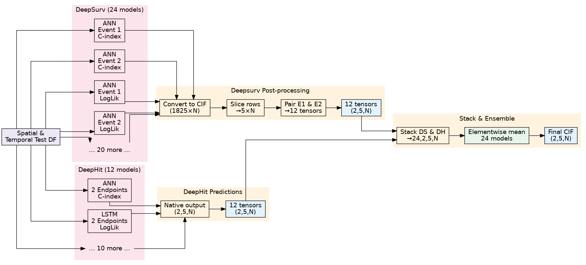

# CKD Risk Prediction MLOps Pipeline

A comprehensive MLOps repository for AI-driven Chronic Kidney Disease (CKD) risk prediction, providing nephrologists and CKD patients with reliable probabilities of starting renal replacement therapy (RRT) and all-cause mortality over 1- to 5-year horizons.

## 🎯 Project Overview

This project implements a full-stack MLOps pipeline that:
- Ingests longitudinal electronic health record (EHR) data
- Trains deep learning survival models (DeepSurv, DeepHit)
- Deploys the best performing models to production
- Continuously monitors real-world performance

### Key Features
- **Advanced Survival Analysis**: Implements state-of-the-art deep learning models for competing risks
- **Ensemble Learning**: Combines multiple models for improved prediction accuracy
- **MLOps Integration**: Full pipeline orchestration with ZenML and experiment tracking with MLflow
- **Clinical Validation**: Achieves c-index ≥ 0.80 for mortality and ≥ 0.95 for RRT predictions

## 🏗️ Architecture

### Pipeline Overview



The pipeline consists of several stages:
1. **Data Ingestion**: Raw CSV data from various sources (lab results, diagnoses, procedures)
2. **Data Preprocessing**: Cleaning, validation, and feature engineering
3. **Model Training**: Deep learning survival models with hyperparameter optimization
4. **Model Evaluation**: Performance metrics and clinical validation
5. **Model Deployment**: Best model selection and deployment

### Ensemble Architecture



The ensemble combines multiple model types:
- **DeepSurv Models**: For single-event survival analysis
- **DeepHit Models**: For competing risks analysis
- **LSTM-based Models**: For temporal pattern recognition
- **Traditional Models**: KFRE (Kidney Failure Risk Equation) as baseline

## 🚀 Getting Started

### Prerequisites

- Python 3.11.8
- CUDA-capable GPU (recommended for deep learning models)
- Docker (optional, for containerized deployment)

### Installation

1. Clone the repository:
```bash
git clone <repository-url>
cd tarot2
```

2. Create a virtual environment:
```bash
python -m venv venv
source venv/bin/activate  # On Windows: venv\Scripts\activate
```

3. Install dependencies:
```bash
pip install -r requirements.txt
```

4. Initialize ZenML (optional but recommended):
```bash
zenml init
```

### Configuration

#### 1. Environment Variables (.env)

Create a `.env` file based on `.env.example`:

```bash
cp .env.example .env
```

Key configurations in `.env`:
- **Data Paths**: Set paths for input data, output directories, and metadata
- **Column Mappings**: Map CSV columns to expected field names for each data type
- **Model Settings**: Configure model hyperparameters and training settings

Example configuration:
```env
# Data paths
DATA_PATH=./data
OUTPUT_DIR=./data_lake
METADATA_DIR=./metadata

# Random seed for reproducibility
RANDOM_SEED=42

# Model training settings
NETWORK_TYPE=mlp
BATCH_SIZE=64
EPOCHS=100
LEARNING_RATE=0.001
```

#### 2. Feature Configuration

Adjust features and column mappings in `src/default_master_df_mapping.yml`:

```yaml
# Define which columns to use as features
features: ['gender', 'creatinine', 'hemoglobin', 'phosphate', 
          'age_at_obs', 'bicarbonate', 'albumin', 'uacr', 
          'cci_score_total', 'ht', 'observation_period']

# Specify categorical vs continuous features
cat_features: ['gender', 'ht', 'myocardial_infarction', ...]
cont_features: ['creatinine', 'hemoglobin', 'phosphate', ...]

# Map columns for KFRE calculation
kfre: {
  'age': 'age',
  'sex': 'gender',
  'egfr': 'egfr',
  'acr': 'uacr',
  'albumin': 'albumin',
  'phosphate': 'phosphate',
  'bicarbonate': 'bicarbonate',
  'calcium': 'calcium'
}
```

#### 3. Hyperparameter Configuration

Configure hyperparameter search space in `src/hyperparameter_config.yml`:

```yaml
model_type: deephit  # Options: deepsurv, deephit
network:
  type: ann  # Options: ann, lstm
  default:
    hidden_dims: [128, 64, 32]
    num_layers: 3
    dropout: 0.2
    batch_size: 64
    learning_rate: 0.001
    epochs: 100

# Hyperparameter search space for optimization
search_space:
  common:
    learning_rate:
      type: float
      min: 0.0001
      max: 0.01
      log: true
    num_layers:
      type: int
      min: 2
      max: 4
```

## 📊 Running the Pipeline

### Basic Usage

Run the complete pipeline:
```bash
python run_pipeline.py
```

### Advanced Options

1. **Data Ingestion Only**:
```bash
python run_pipeline.py --data-path data --output-dir data_lake ingest
```

2. **Model Training with Custom Config**:
```bash
python run_pipeline.py --config custom_config.yml train
```

3. **Run Without ZenML** (for testing):
```bash
python run_pipeline.py --no-zenml
```

## 📈 Model Performance

Target metrics:
- **C-index**: ≥ 0.80 for mortality, ≥ 0.95 for RRT
- **Integrated Brier Score**: < 0.10
- **Inference Time**: < 200ms (P95)

## 🛠️ Technology Stack

| Component | Technology |
|-----------|------------|
| Language | Python 3.11.8 |
| Deep Learning | PyTorch 2.4.1, PyCox |
| MLOps Orchestration | ZenML 0.82.1 |
| Experiment Tracking | MLflow 2.22.0 |
| Data Validation | Great Expectations, Pandera |
| Serving | MLflow Model Server |
| Monitoring | Prometheus + Grafana |

## 📁 Project Structure

```
tarot2/
├── data/                  # Raw input data
├── docs/                  # Documentation
├── examples/              # Example scripts
├── pipelines/             # ZenML pipeline definitions
├── src/                   # Source code
│   ├── nn_architectures.py    # Neural network definitions
│   ├── survival_utils.py      # Survival analysis utilities
│   └── ...
├── steps/                 # ZenML pipeline steps
├── test/                  # Test files
├── .env.example          # Environment variables template
├── requirements.txt      # Python dependencies
└── run_pipeline.py       # Main pipeline runner
```

