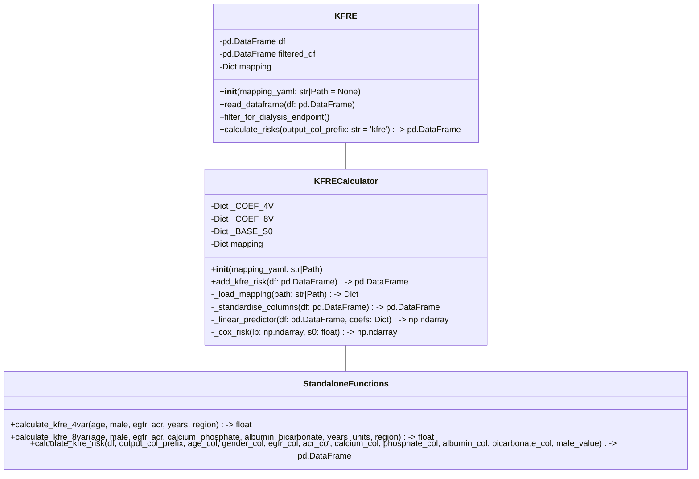
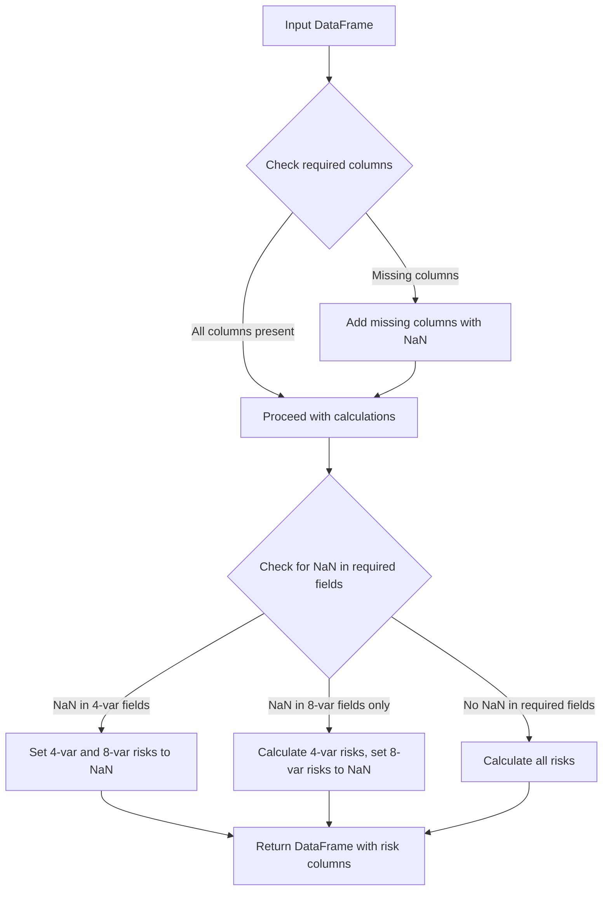
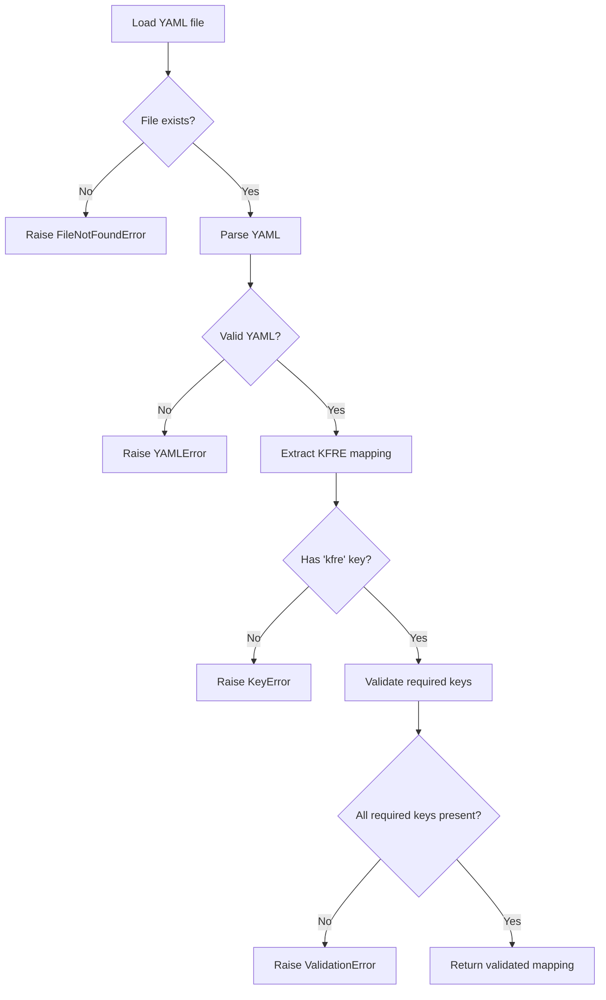

# KFRE Calculator Implementation Plan

## 1. Overview

This document outlines the implementation plan for a Python module (`KFRE.py`) that calculates Kidney Failure Risk Equation (KFRE) predictions. The module will:

- Support both 4-variable and 8-variable KFRE models
- Calculate risks for both 2-year and 5-year time horizons
- Process pandas DataFrames and add risk columns
- Use a YAML mapping file to map user column names to standard KFRE variable names
- Be null-safe and use vectorized operations
- Handle different units for biochemical values

## 2. Module Structure



## 3. Constants and Coefficients

```python
# Non-North American coefficients
_COEF_4V = {
    "age": -0.01985,
    "egfr": -0.09886,
    "lnacr": 0.35066,
    "sex": 0.14842,  # male = 1
}

_COEF_8V = {
    **_COEF_4V,
    "albumin": -0.03727,
    "phosphate": 0.90638,
    "bicarbonate": -0.07257,
    "calcium": -0.79539,
}

# Baseline survivals
_BASE_S0 = {
    "4v2y": 0.9878,
    "4v5y": 0.9570,
    "8v2y": 0.9878,
    "8v5y": 0.9570,
}
```

## 4. Unit Conversion Strategy

### 4.1 Unit Conversion Functions

```python
def convert_albumin(value, unit=None):
    """
    Convert albumin to g/L (standard unit for KFRE).
    
    Parameters
    ----------
    value : float
        Albumin value
    unit : str, optional
        Unit of the value. Options: 'g/L', 'g/dL'
        If None, assumes value is already in g/L
        
    Returns
    -------
    float
        Albumin value in g/L
    """
    if pd.isna(value):
        return np.nan
        
    if unit is None or unit.lower() == 'g/l':
        return value
    elif unit.lower() == 'g/dl':
        return value * 10.0
    else:
        raise ValueError(f"Unsupported albumin unit: {unit}. Use 'g/L' or 'g/dL'.")

def convert_phosphate(value, unit=None):
    """
    Convert phosphate to mmol/L (standard unit for KFRE).
    
    Parameters
    ----------
    value : float
        Phosphate value
    unit : str, optional
        Unit of the value. Options: 'mmol/L', 'mg/dL'
        If None, assumes value is already in mmol/L
        
    Returns
    -------
    float
        Phosphate value in mmol/L
    """
    if pd.isna(value):
        return np.nan
        
    if unit is None or unit.lower() == 'mmol/l':
        return value
    elif unit.lower() == 'mg/dl':
        return value * 0.3229  # Conversion factor from mg/dL to mmol/L
    else:
        raise ValueError(f"Unsupported phosphate unit: {unit}. Use 'mmol/L' or 'mg/dL'.")

def convert_calcium(value, unit=None):
    """
    Convert calcium to mmol/L (standard unit for KFRE).
    
    Parameters
    ----------
    value : float
        Calcium value
    unit : str, optional
        Unit of the value. Options: 'mmol/L', 'mg/dL'
        If None, assumes value is already in mmol/L
        
    Returns
    -------
    float
        Calcium value in mmol/L
    """
    if pd.isna(value):
        return np.nan
        
    if unit is None or unit.lower() == 'mmol/l':
        return value
    elif unit.lower() == 'mg/dl':
        return value * 0.2495  # Conversion factor from mg/dL to mmol/L
    else:
        raise ValueError(f"Unsupported calcium unit: {unit}. Use 'mmol/L' or 'mg/dL'.")

def convert_bicarbonate(value, unit=None):
    """
    Convert bicarbonate to mmol/L (standard unit for KFRE).
    
    Parameters
    ----------
    value : float
        Bicarbonate value
    unit : str, optional
        Unit of the value. Options: 'mmol/L', 'mEq/L'
        If None, assumes value is already in mmol/L
        
    Returns
    -------
    float
        Bicarbonate value in mmol/L
    """
    if pd.isna(value):
        return np.nan
        
    if unit is None or unit.lower() in ['mmol/l', 'meq/l']:
        # mmol/L and mEq/L are equivalent for bicarbonate
        return value
    else:
        raise ValueError(f"Unsupported bicarbonate unit: {unit}. Use 'mmol/L' or 'mEq/L'.")
```

## 5. Null Value Handling Strategy



### 5.1 Null Handling in Linear Predictor Calculation

```python
def _linear_predictor(self, df, coefs):
    """
    Calculate linear predictor using vectorized operations.
    
    Parameters
    ----------
    df : pd.DataFrame
        DataFrame with standardized columns
    coefs : dict
        Dictionary of coefficients
        
    Returns
    -------
    np.ndarray
        Linear predictor values
    """
    # Extract variables in fixed order
    vars_needed = list(coefs.keys())
    X = df[vars_needed].astype(float).to_numpy()
    beta = np.array([coefs[v] for v in vars_needed], dtype=float)
    
    # Calculate linear predictor
    lp = np.dot(np.where(np.isnan(X), np.nan, X), beta)
    
    # If any required input in a row is NaN, make LP NaN
    lp[np.any(np.isnan(X), axis=1)] = np.nan
    
    return lp
```

## 6. YAML Mapping File Handling

### 6.1 YAML Loading and Validation Process



### 6.2 YAML Loading Function

```python
def _load_mapping(self, path: str | Path) -> Dict[str, str]:
    """
    Load and validate the YAML mapping file.
    
    Parameters
    ----------
    path : str or pathlib.Path
        Path to the YAML mapping file
        
    Returns
    -------
    Dict[str, str]
        Dictionary mapping standard KFRE variable names to user column names
        
    Raises
    ------
    FileNotFoundError
        If the mapping file does not exist
    yaml.YAMLError
        If the mapping file is not valid YAML
    KeyError
        If the mapping file does not contain the 'kfre' key
    ValidationError
        If the mapping file is missing required keys
    """
    # Check if file exists
    path_obj = Path(path)
    if not path_obj.exists():
        raise FileNotFoundError(f"Mapping file not found: {path}")
    
    try:
        # Load YAML file
        with open(path_obj, "r", encoding="utf-8") as fh:
            yaml_content = yaml.safe_load(fh)
    except yaml.YAMLError as e:
        raise yaml.YAMLError(f"Error parsing YAML file: {e}")
    
    # Check if 'kfre' key exists
    if 'kfre' not in yaml_content:
        raise KeyError("Mapping file must contain a 'kfre' key")
    
    # Extract KFRE mapping
    mapping = yaml_content['kfre']
    
    # Validate required keys
    self._validate_mapping(mapping)
    
    return mapping
```

### 6.3 Mapping Validation Function

```python
def _validate_mapping(self, mapping: Dict[str, str]) -> None:
    """
    Validate that the mapping contains all required keys.
    
    Parameters
    ----------
    mapping : Dict[str, str]
        Dictionary mapping standard KFRE variable names to user column names
        
    Raises
    ------
    ValidationError
        If the mapping is missing required keys
    """
    # Define required keys for 4-variable and 8-variable KFRE
    required_keys_4v = {'age', 'sex', 'egfr', 'acr'}
    required_keys_8v = required_keys_4v.union({'albumin', 'phosphate', 'bicarbonate', 'calcium'})
    
    # Check if all required keys are present
    missing_keys_4v = required_keys_4v.difference(mapping.keys())
    missing_keys_8v = required_keys_8v.difference(mapping.keys())
    
    # Prepare error message
    error_msgs = []
    if missing_keys_4v:
        error_msgs.append(f"Missing required keys for 4-variable KFRE: {sorted(missing_keys_4v)}")
    if missing_keys_8v and not missing_keys_4v:  # Only show 8v message if 4v is complete
        error_msgs.append(f"Missing required keys for 8-variable KFRE: {sorted(missing_keys_8v)}")
    
    # Raise error if any keys are missing
    if error_msgs:
        raise ValidationError("\n".join(error_msgs))
```

## 7. Implementation Approach

1. **Start with the constants and coefficients**: Define all the necessary constants and coefficients at the top of the module.

2. **Implement the utility functions**: Create the unit conversion functions and any other utility functions needed.

3. **Implement the KFRECalculator class**: This is the core of the module, implementing the KFRE calculations using vectorized NumPy operations.

4. **Implement the standalone functions**: These provide a simpler interface for calculating KFRE risks for individual patients or DataFrames.

5. **Implement the KFRE class**: This provides additional functionality on top of the KFRECalculator class.

6. **Add CLI functionality**: Implement a simple command-line interface for batch processing.

7. **Test the implementation**: Ensure that the implementation passes all the tests in the test files.

## 8. Key Considerations

- **Null safety**: Ensure that the implementation handles missing values gracefully, propagating NaN values rather than raising exceptions.

- **Vectorization**: Use vectorized NumPy operations for performance, avoiding Python loops over rows.

- **Unit handling**: Properly handle different units for biochemical values, converting them to the standard units used in the KFRE equations.

- **Functional style**: Ensure that the original DataFrame is not modified, returning a new DataFrame with the added risk columns.