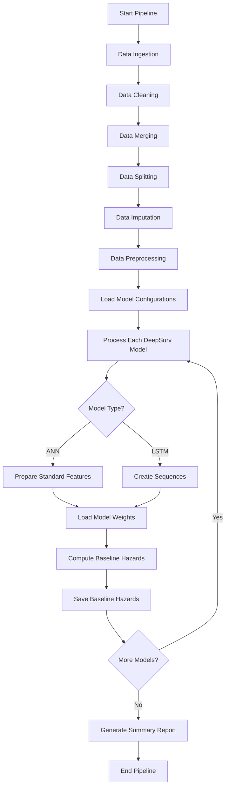
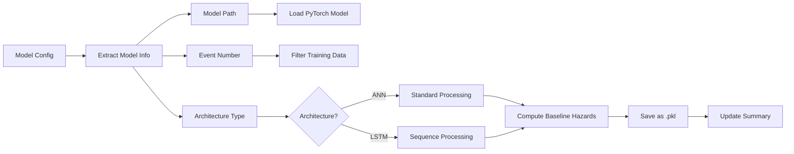

# Baseline Hazard Computation Pipeline Flow

## Pipeline Overview



## Detailed Model Processing Flow



## Data Flow for Each Model

### For ANN Models:
1. Load model configuration
2. Extract features from training data
3. Filter for specific event (1 or 2)
4. Load model weights
5. Compute baseline hazards using CoxPH
6. Save baseline hazards

### For LSTM Models:
1. Load model configuration
2. Create sequences from training data
3. Filter sequences for specific event
4. Load model weights with LSTM architecture
5. Compute baseline hazards using sequential data
6. Save baseline hazards

## File Structure

```
results/final_deploy/
├── models/
│   ├── Ensemble_model1_DeepSurv_ANN_Event_1_*.pt
│   ├── Ensemble_model2_DeepSurv_ANN_Event_1_*.pt
│   ├── ...
│   ├── Ensemble_model24_DeepSurv_LSTM_Event_2_*.pt
│   │
│   └── baseline_hazards/  (NEW - to be created)
│       ├── baseline_hazards_model1_*.pkl
│       ├── baseline_hazards_model2_*.pkl
│       └── ...
│
└── model_config/
    ├── model_config.csv
    ├── model1_details_*.json
    ├── model1_optimization_metrics_*.json
    └── ...
```

## Key Components

### 1. Model Loading
- Detect architecture from model name
- Load appropriate network structure
- Handle different hidden layer configurations

### 2. Data Preparation
- **ANN**: Direct feature extraction
- **LSTM**: Sequence creation with length=5

### 3. Baseline Hazard Computation
- Use pycox CoxPH model
- Call `compute_baseline_hazards()` method
- Store both hazards and cumulative hazards

### 4. Error Handling
- Try-except blocks for each model
- Continue processing on failure
- Log all errors with model details

## Success Criteria
- All 24 DeepSurv models have baseline hazards computed
- Baseline hazards saved in standardized format
- Summary report shows successful computations
- Models can be loaded and used for predictions