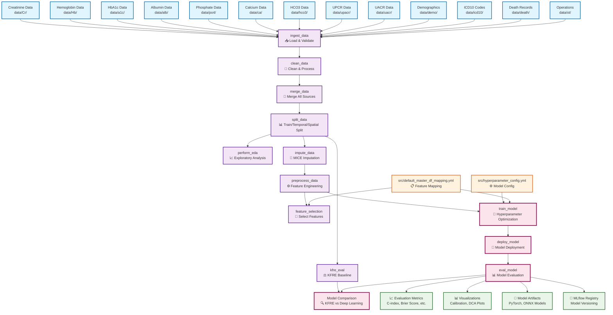

# CKD Risk Prediction Data Pipeline Flowchart

## Pipeline Description

### Data Ingestion Phase
- **Multiple Data Sources**: Ingests 13 different types of clinical data including lab results, demographics, diagnoses, and outcomes
- **Validation**: Automatic schema detection and data validation during ingestion
- **Format Conversion**: Converts CSV files to efficient Parquet format

### Data Processing Phase
- **Cleaning**: Standardizes data formats, handles missing values, calculates derived features
- **Merging**: Combines all data sources into a unified master dataframe
- **Splitting**: Creates temporal and spatial test sets for robust evaluation

### Analysis & Modeling Phase
- **EDA**: Comprehensive exploratory data analysis with statistical summaries
- **KFRE Baseline**: Calculates Kidney Failure Risk Equation as baseline comparison
- **Feature Engineering**: Advanced preprocessing including scaling, encoding, and derived features
- **Feature Selection**: Statistical feature selection with VIF analysis
- **Deep Learning**: Hyperparameter optimization for DeepSurv/DeepHit models using Optuna
- **Evaluation**: Comprehensive model evaluation with survival analysis metrics

### Configuration Management
- **Hyperparameter Config**: YAML-based configuration for model architectures and optimization
- **Feature Mapping**: Centralized feature definitions ensuring consistency across pipeline

### Outputs & Artifacts
- **Model Artifacts**: Trained models in PyTorch and ONNX formats
- **Evaluation Metrics**: C-index, Brier score, calibration metrics with confidence intervals
- **Visualizations**: Calibration plots, decision curve analysis, SHAP explanations
- **MLflow Integration**: Automatic model versioning and experiment tracking