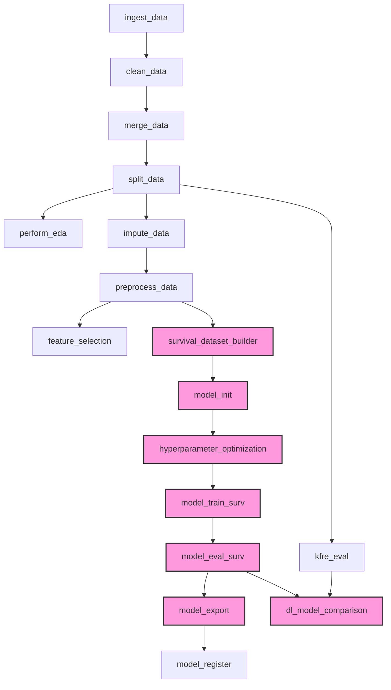

# Deep Learning Survival Modeling Implementation Plan

## 1. Overview

This plan outlines the steps to integrate PyCox Deepsurv (cause-specific) and Deephit (competing-risks) models into the existing ZenML/MLflow pipeline for CKD risk prediction. The implementation will allow predicting:

1. Risk of RRT start or eGFR < 15 (Endpoint 1)
2. Risk of all-cause mortality (Endpoint 2)

The solution will be fully integrated with the existing pipeline, with proper experiment tracking, model evaluation, and model registration.

## 2. Architecture

### 2.1 Pipeline Structure



### 2.2 New Components

1. **survival_dataset_builder**: Converts pandas DataFrames to PyCox SurvDataset objects
2. **model_init**: Creates PyTorch neural networks for Deepsurv and Deephit
3. **hyperparameter_optimization**: Performs Optuna-based hyperparameter search
4. **model_train_surv**: Trains the selected model with early stopping
5. **model_eval_surv**: Evaluates models using C-index, IBS, t-AUC
6. **model_export**: Exports models to PyTorch (.pt) and ONNX formats
7. **model_register**: Registers models in MLflow with appropriate metadata
8. **dl_model_comparison**: Compares KFRE, Deepsurv, and Deephit side-by-side

## 3. Implementation Details

### 3.1 New Files to Create

1. **steps/survival_dataset_builder.py**
   - Converts pandas DataFrames to PyCox SurvDataset objects
   - Handles feature scaling and encoding
   - Creates train/validation/test datasets

2. **steps/model_init.py**
   - Defines PyTorch network architectures for Deepsurv and Deephit
   - Creates and initializes the networks

3. **steps/hyperparameter_optimization.py**
   - Implements Optuna-based hyperparameter search
   - Defines search space for each model type
   - Handles cross-validation and early stopping

4. **steps/model_train_surv.py**
   - Trains the selected model with the optimal hyperparameters
   - Implements early stopping
   - Logs training metrics to MLflow

5. **steps/model_eval_surv.py**
   - Evaluates models using C-index, IBS, t-AUC
   - Generates calibration plots
   - Creates HTML evaluation reports

6. **steps/model_export.py**
   - Exports models to PyTorch (.pt) format
   - Converts models to ONNX format
   - Validates ONNX models

7. **steps/dl_model_comparison.py**
   - Compares KFRE, Deepsurv, and Deephit side-by-side
   - Generates comparative metrics and plots
   - Creates HTML comparison reports

8. **src/nn_architectures.py**
   - Defines MLP for Deepsurv
   - Defines CNN-MLP for Deephit
   - Implements custom PyTorch modules

9. **src/survival_utils.py**
   - Utility functions for survival analysis
   - Metrics calculation
   - Data preprocessing

### 3.2 Files to Modify

1. **pipelines/training_pipeline.py**
   - Add new steps to the pipeline
   - Implement model type selection via CLI flag and run_name
   - Update pipeline flow based on model selection

2. **src/default_master_df_mapping.yml**
   - Add any necessary configurations for deep learning models

## 4. Detailed Step Implementations

### 4.1 survival_dataset_builder

```python
@step
def survival_dataset_builder(
    train_df: pd.DataFrame,
    temporal_test_df: pd.DataFrame,
    spatial_test_df: pd.DataFrame,
    features: List[str],
    duration_col: str = "duration",
    event_col: str = "endpoint",
) -> Tuple[SurvDataset, SurvDataset, SurvDataset, Dict[str, Any], LabelEncoder]:
    """
    Convert pandas DataFrames to PyCox SurvDataset objects.
    
    Args:
        train_df: Training DataFrame
        temporal_test_df: Temporal test DataFrame
        spatial_test_df: Spatial test DataFrame
        features: List of feature columns to use
        duration_col: Name of the duration column
        event_col: Name of the event column
        
    Returns:
        Tuple containing:
        - train_ds: Training SurvDataset
        - temporal_ds: Temporal test SurvDataset
        - spatial_ds: Spatial test SurvDataset
        - feature_scaler: Fitted feature scaler
        - labeller: Fitted label encoder
    """
    # Implementation details...
```

### 4.2 model_init

```python
@step
def model_init(
    model_type: str,
    input_dim: int,
    hidden_dims: List[int] = [128, 64, 32],
    dropout: float = 0.2,
    output_dim: int = 1,
    activation: str = "relu"
) -> torch.nn.Module:
    """
    Initialize a PyTorch neural network for survival analysis.
    
    Args:
        model_type: Type of model ("deepsurv" or "deephit")
        input_dim: Number of input features
        hidden_dims: List of hidden layer dimensions
        dropout: Dropout rate
        output_dim: Output dimension (1 for DeepSurv, num_durations for DeepHit)
        activation: Activation function to use
        
    Returns:
        Initialized PyTorch neural network
    """
    # Implementation details...
```

### 4.3 hyperparameter_optimization

```python
@step
def hyperparameter_optimization(
    train_ds: SurvDataset,
    val_ds: SurvDataset,
    model_type: str,
    input_dim: int,
    max_trials: int = 50,
    n_epochs: int = 100,
    patience: int = 10,
    seed: int = 42
) -> Dict[str, Any]:
    """
    Perform hyperparameter optimization using Optuna.
    
    Args:
        train_ds: Training dataset
        val_ds: Validation dataset
        model_type: Type of model ("deepsurv" or "deephit")
        input_dim: Number of input features
        max_trials: Maximum number of trials for optimization
        n_epochs: Maximum number of epochs per trial
        patience: Early stopping patience
        seed: Random seed
        
    Returns:
        Dictionary containing best hyperparameters and optimization results
    """
    # Implementation details...
```

#### Hyperparameter Optimization and ZenML Caching Integration

The hyperparameter optimization step will be designed to work efficiently with ZenML's caching mechanism:

1. **Deterministic Trial Generation**:
   - We'll use a fixed random seed for Optuna to ensure that the same hyperparameter trials are generated for the same inputs.
   - This makes the step deterministic, allowing ZenML to properly cache results.

2. **Input Hashing**:
   - The step's cache key will be based on the hash of:
     - Training dataset features and targets
     - Validation dataset features and targets
     - Model type
     - Search space configuration
     - Number of trials and other optimization parameters

3. **Pruning and Early Stopping**:
   - We'll implement Optuna's pruning mechanism to terminate unpromising trials early.
   - This reduces computation time while still exploring the search space effectively.

4. **Serialization of Study**:
   - The complete Optuna study will be serialized and saved as an artifact.
   - This allows for inspection of all trials, not just the best one.
   - The study can be loaded for further analysis or visualization.

5. **Caching Strategy**:
   - For small changes to the pipeline that don't affect the hyperparameter optimization (e.g., changes to evaluation metrics), the cached results will be reused.
   - For changes to the model architecture, features, or optimization parameters, a new optimization will be triggered.

6. **Incremental Optimization**:
   - We'll implement a mechanism to resume optimization from a previous study if available.
   - This allows for incremental optimization across pipeline runs.

7. **Parameter Importance Analysis**:
   - After optimization, we'll analyze parameter importance to understand which hyperparameters have the most impact.
   - This information can be used to refine the search space in future runs.

8. **MLflow Integration**:
   - All trials will be logged to MLflow for visualization and comparison.
   - This includes hyperparameters, validation metrics, and training curves.

9. **Parallel Optimization**:
   - We'll support parallel trial execution to speed up the optimization process.
   - This can be configured based on available resources.

10. **Custom Callbacks**:
    - We'll implement custom callbacks to log intermediate results during optimization.
    - This provides visibility into the optimization process and helps with debugging.

Example implementation of the trial function:

```python
def objective(trial, train_ds, val_ds, model_type, input_dim, n_epochs, patience, seed):
    # Set random seeds for reproducibility
    torch.manual_seed(seed)
    np.random.seed(seed)
    
    # Sample hyperparameters
    lr = trial.suggest_float("learning_rate", 1e-4, 1e-2, log=True)
    num_layers = trial.suggest_int("num_layers", 2, 4)
    hidden_units = trial.suggest_int("hidden_units", 32, 256)
    dropout = trial.suggest_float("dropout", 0.0, 0.5)
    optimizer_name = trial.suggest_categorical("optimizer", ["Adam", "AdamW"])
    
    # Model-specific hyperparameters
    if model_type == "deephit":
        alpha = trial.suggest_float("alpha", 0.1, 1.0)
    
    # Build network architecture
    hidden_dims = [hidden_units] * num_layers
    net = create_network(model_type, input_dim, hidden_dims, dropout)
    
    # Create optimizer
    if optimizer_name == "Adam":
        optimizer = torch.optim.Adam(net.parameters(), lr=lr)
    else:
        optimizer = torch.optim.AdamW(net.parameters(), lr=lr)
    
    # Create model
    if model_type == "deepsurv":
        model = CoxPH(net, optimizer=optimizer)
    else:
        model = DeepHit(net, optimizer=optimizer, alpha=alpha)
    
    # Create callbacks for early stopping
    early_stopping = EarlyStopping(patience=patience)
    
    # Train model
    log = model.fit(
        train_ds, 
        val_ds, 
        epochs=n_epochs, 
        callbacks=[early_stopping],
        verbose=False
    )
    
    # Get best validation metric
    best_epoch = np.argmin(log.val_loss)
    best_val_loss = log.val_loss[best_epoch]
    
    # Report intermediate values for pruning
    for epoch, (train_loss, val_loss) in enumerate(zip(log.train_loss, log.val_loss)):
        trial.report(val_loss, epoch)
        if trial.should_prune():
            raise optuna.TrialPruned()
    
    return best_val_loss
```

### 4.4 model_train_surv

```python
@step
def model_train_surv(
    train_ds: SurvDataset,
    val_ds: SurvDataset,
    model_type: str,
    hyperparams: Dict[str, Any],
    input_dim: int,
    n_epochs: int = 100,
    patience: int = 10,
    seed: int = 42
) -> Tuple[torch.nn.Module, Dict[str, Any], pd.DataFrame]:
    """
    Train a survival model with the given hyperparameters.
    
    Args:
        train_ds: Training dataset
        val_ds: Validation dataset
        model_type: Type of model ("deepsurv" or "deephit")
        hyperparams: Hyperparameters from optimization
        input_dim: Number of input features
        n_epochs: Maximum number of epochs
        patience: Early stopping patience
        seed: Random seed
        
    Returns:
        Tuple containing:
        - trained_model: Trained PyTorch model
        - best_params: Best hyperparameters
        - training_log: Training metrics log
    """
    # Implementation details...
```

### 4.5 model_eval_surv

```python
@step
def model_eval_surv(
    model: torch.nn.Module,
    model_type: str,
    train_ds: SurvDataset,
    temporal_ds: SurvDataset,
    spatial_ds: SurvDataset,
    time_points: List[int] = [365, 730, 1095, 1460, 1825]
) -> Tuple[Dict[str, Any], str]:
    """
    Evaluate a survival model on multiple datasets.
    
    Args:
        model: Trained model
        model_type: Type of model ("deepsurv" or "deephit")
        train_ds: Training dataset
        temporal_ds: Temporal test dataset
        spatial_ds: Spatial test dataset
        time_points: Time points for evaluation (in days)
        
    Returns:
        Tuple containing:
        - metrics: Dictionary of evaluation metrics
        - report_path: Path to the HTML evaluation report
    """
    # Implementation details...
```

### 4.6 model_export

```python
@step
def model_export(
    model: torch.nn.Module,
    model_type: str,
    input_dim: int,
    feature_names: List[str],
    output_dir: str = "models"
) -> Dict[str, str]:
    """
    Export a trained model to PyTorch and ONNX formats.
    
    Args:
        model: Trained model
        model_type: Type of model ("deepsurv" or "deephit")
        input_dim: Number of input features
        feature_names: Names of input features
        output_dir: Directory to save models
        
    Returns:
        Dictionary containing paths to saved model files
    """
    # Implementation details...
```

### 4.7 model_register

```python
@step
def model_register(
    model_paths: Dict[str, str],
    metrics: Dict[str, Any],
    model_type: str,
    hyperparams: Dict[str, Any],
    feature_names: List[str],
    report_path: str,
    stage: str = "Staging"
) -> str:
    """
    Register a model in MLflow model registry.
    
    Args:
        model_paths: Paths to model files
        metrics: Evaluation metrics
        model_type: Type of model ("deepsurv" or "deephit")
        hyperparams: Model hyperparameters
        feature_names: Names of input features
        report_path: Path to evaluation report
        stage: MLflow model stage
        
    Returns:
        MLflow model URI
    """
    # Implementation details...
```

### 4.8 dl_model_comparison

```python
@step
def dl_model_comparison(
    kfre_results: Dict[str, Any],
    deepsurv_metrics: Dict[str, Any] = None,
    deephit_metrics: Dict[str, Any] = None,
    time_points: List[int] = [365, 730, 1095, 1460, 1825],
    output_dir: str = "comparison"
) -> str:
    """
    Compare KFRE, Deepsurv, and Deephit models side-by-side.
    
    Args:
        kfre_results: Results from KFRE evaluation
        deepsurv_metrics: Metrics from Deepsurv evaluation
        deephit_metrics: Metrics from Deephit evaluation
        time_points: Time points for comparison (in days)
        output_dir: Directory to save comparison report
        
    Returns:
        Path to HTML comparison report
    """
    # Implementation details...
```

## 5. Pipeline Integration

### 5.1 Modified training_pipeline.py

```python
@pipeline(enable_cache=True)
def train_pipeline(model_type: str = None):
    """
    Pipeline for training the CKD risk prediction model.
    
    Args:
        model_type: Type of model to train ("deepsurv", "deephit", or "tree")
    """
    # Import steps
    from steps.ingest_data import ingest_data
    from steps.clean_data import clean_data
    # ... other existing imports ...
    
    # Import new steps
    from steps.survival_dataset_builder import survival_dataset_builder
    from steps.model_init import model_init
    from steps.hyperparameter_optimization import hyperparameter_optimization
    from steps.model_train_surv import model_train_surv
    from steps.model_eval_surv import model_eval_surv
    from steps.model_export import model_export
    from steps.model_register import model_register
    from steps.dl_model_comparison import dl_model_comparison
    
    # Determine model type from run_name if not provided
    if model_type is None:
        run_name = os.getenv("ZENML_RUN_NAME", "")
        if "deepsurv" in run_name.lower():
            model_type = "deepsurv"
        elif "deephit" in run_name.lower():
            model_type = "deephit"
        else:
            model_type = "tree"  # Default to tree-based model
    
    # Execute common pipeline steps
    # ... existing pipeline steps ...
    
    # Branch based on model type
    if model_type in ["deepsurv", "deephit"]:
        # Deep learning survival model path
        train_ds, temporal_ds, spatial_ds, feature_scaler, labeller = survival_dataset_builder(
            train_df=train_df_preprocessed,
            temporal_test_df=temporal_test_df_preprocessed,
            spatial_test_df=spatial_test_df_preprocessed,
            features=feature_cols
        )
        
        input_dim = len(feature_cols)
        
        # Initialize model
        net = model_init(
            model_type=model_type,
            input_dim=input_dim
        )
        
        # Hyperparameter optimization
        best_hyperparams = hyperparameter_optimization(
            train_ds=train_ds,
            val_ds=temporal_ds,  # Use temporal test as validation
            model_type=model_type,
            input_dim=input_dim
        )
        
        # Train model with best hyperparameters
        trained_model, final_hyperparams, training_log = model_train_surv(
            train_ds=train_ds,
            val_ds=temporal_ds,
            model_type=model_type,
            hyperparams=best_hyperparams,
            input_dim=input_dim
        )
        
        # Evaluate model
        metrics, report_path = model_eval_surv(
            model=trained_model,
            model_type=model_type,
            train_ds=train_ds,
            temporal_ds=temporal_ds,
            spatial_ds=spatial_ds
        )
        
        # Export model
        model_paths = model_export(
            model=trained_model,
            model_type=model_type,
            input_dim=input_dim,
            feature_names=feature_cols
        )
        
        # Register model
        model_uri = model_register(
            model_paths=model_paths,
            metrics=metrics,
            model_type=model_type,
            hyperparams=final_hyperparams,
            feature_names=feature_cols,
            report_path=report_path
        )
        
        # Compare with KFRE (if KFRE evaluation was run)
        if 'kfre_results' in locals():
            comparison_report = dl_model_comparison(
                kfre_results=kfre_results,
                deepsurv_metrics=metrics if model_type == "deepsurv" else None,
                deephit_metrics=metrics if model_type == "deephit" else None
            )
        
        return model_uri, metrics
    else:
        # Tree-based model path (existing implementation)
        # ... existing tree-based model code ...
```

## 6. CLI Integration

```python
# cli.py
import click
from zenml.cli.cli import cli
from pipelines.training_pipeline import train_pipeline

@cli.command()
@click.option("--model_type", type=click.Choice(["deepsurv", "deephit", "tree"]), 
              help="Type of model to train")
def run_training(model_type):
    """Run the CKD risk prediction training pipeline."""
    train_pipeline(model_type=model_type)
```

## 7. Implementation Timeline

### Week 1: Core Implementation

| Day | Tasks |
|-----|-------|
| 1 | Implement survival_dataset_builder and unit tests |
| 2 | Implement model_init and nn_architectures |
| 3 | Implement hyperparameter_optimization with Optuna |
| 4 | Implement model_train_surv with early stopping |
| 5 | Implement model_eval_surv with metrics calculation |

### Week 2: Integration and Refinement

| Day | Tasks |
|-----|-------|
| 6 | Implement model_export with ONNX conversion |
| 7 | Implement model_register with MLflow integration |
| 8 | Implement dl_model_comparison for side-by-side evaluation |
| 9 | Modify training_pipeline.py for model type switching |
| 10 | Write documentation, finalize tests, and prepare for review |

## 8. Testing Strategy

1. **Unit Tests**: For each new component
   - Test data conversion in survival_dataset_builder
   - Test model architecture creation in model_init
   - Test hyperparameter optimization with small search space
   - Test model training with dummy data
   - Test evaluation metrics calculation
   - Test ONNX conversion and validation

2. **Integration Tests**: For pipeline flow
   - Test end-to-end pipeline with small dataset
   - Test model type switching
   - Test MLflow integration
   - Test caching behavior

3. **Acceptance Tests**: As defined in PRD
   - AT-01: Verify pipeline completion and model registration
   - AT-02: Verify evaluation report contents
   - AT-03: Verify caching behavior
   - AT-04: Verify ONNX model loading and prediction

## 9. Dependencies

```
# requirements.txt additions
pycox>=0.2.3
torch>=1.10.0
torchtuples>=0.2.0
optuna>=2.10.0
onnx>=1.10.0
onnxruntime>=1.9.0
scikit-survival>=0.17.0
lifelines>=0.26.0
matplotlib>=3.5.0
seaborn>=0.11.2
```

## 10. Risks and Mitigations

| Risk | Mitigation |
|------|------------|
| GPU memory overflow | Implement mini-batch training and gradient accumulation |
| Class imbalance | Use NearMiss/SMOTE during preprocessing; monitor per-class metrics |
| Version compatibility | Pin dependency versions in requirements.txt; add version checks |
| Training instability | Implement robust early stopping; use learning rate scheduling |
| Poor generalization | Use temporal and spatial validation; implement regularization |