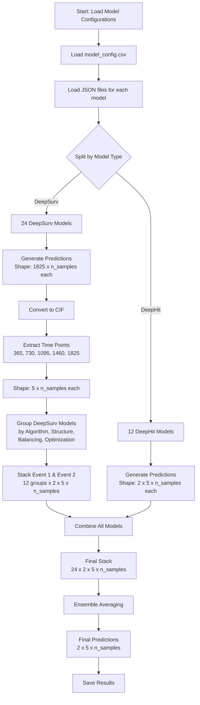
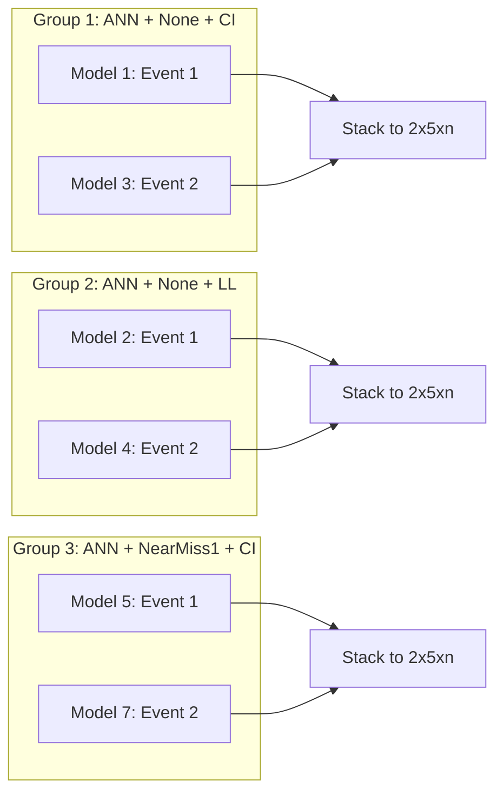
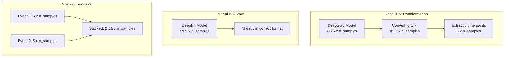
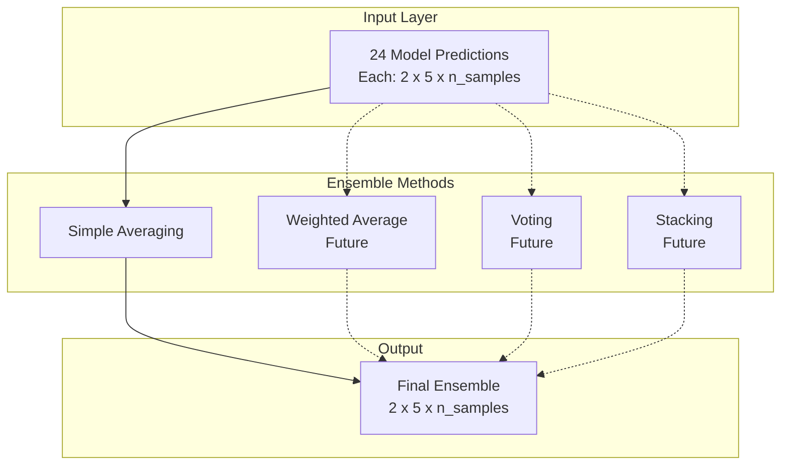

# Multi-Model Ensemble Flow Diagram

## Overall Process Flow

## DeepSurv Grouping Logic

## Prediction Shape Transformations

## Ensemble Architecture

## Data Flow Summary

1. **Input**: 36 models (24 DeepSurv + 12 DeepHit)
2. **DeepSurv Processing**:
   - Convert survival probabilities to CIF
   - Extract 5 specific time points
   - Group by characteristics
   - Stack Event 1 & 2 predictions
3. **Combination**: Stack all 24 model groups
4. **Ensemble**: Average across all models
5. **Output**: Final predictions for 2 endpoints at 5 time points