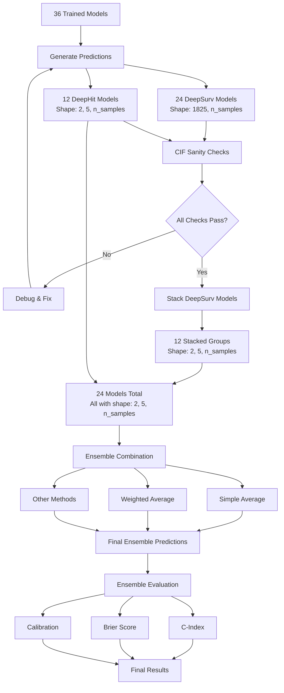

# Ensemble Model Workflow

## Overview
This diagram shows the complete workflow from individual model predictions to final ensemble evaluation.



## Detailed Steps

### 1. Prediction Generation (Completed ✓)
- **Input**: 36 trained models + test datasets
- **Output**: Individual predictions for each model
- **Status**: Successfully generated all predictions

### 2. CIF Sanity Verification (Current Step)
- **Purpose**: Ensure predictions are valid and reasonable
- **Checks**:
  - Value range (0-1)
  - Monotonicity
  - Competition constraints
  - Shape consistency
  - No NaN/Inf values

### 3. DeepSurv Stacking (Next Step)
- **Input**: 24 DeepSurv predictions (1825, n_samples)
- **Process**: 
  - Group by model pairs (Event 1 + Event 2)
  - Extract predictions at 5 time points
  - Stack into (2, 5, n_samples) format
- **Output**: 12 stacked predictions

### 4. Ensemble Combination
- **Input**: 24 models with consistent shape (2, 5, n_samples)
- **Methods**:
  - Simple averaging
  - Weighted averaging (based on individual performance)
  - Stacking with meta-learner
- **Output**: Single ensemble prediction

### 5. Evaluation
- **Metrics**:
  - Concordance Index (discrimination)
  - Brier Score (calibration)
  - Calibration plots
  - Event-specific performance

## Data Flow

### Temporal Dataset
- **Size**: 42,953 samples
- **Flow**: Raw → Preprocessed → Predictions → Stacked → Ensemble → Evaluation

### Spatial Dataset
- **Size**: 155,042 samples
- **Flow**: Raw → Preprocessed → Predictions → Stacked → Ensemble → Evaluation

## File Organization

```
results/final_deploy/
├── individual_predictions/       # Original predictions (✓)
│   ├── temporal_predictions_model{1-36}_*.h5
│   └── spatial_predictions_model{1-36}_*.h5
├── stacked_predictions/         # After stacking (pending)
│   ├── temporal_stacked_group{1-12}_*.h5
│   └── spatial_stacked_group{1-12}_*.h5
├── ensemble_predictions/        # Final ensemble (pending)
│   ├── temporal_ensemble_*.h5
│   └── spatial_ensemble_*.h5
└── evaluation_results/          # Performance metrics (pending)
    ├── individual_performance.json
    ├── ensemble_performance.json
    └── comparison_plots/
```

## Key Decisions Made

1. **Time Point Selection**: Use 5 yearly points (365, 730, 1095, 1460, 1825 days)
2. **Stacking Method**: Simple extraction at specific indices
3. **Ensemble Method**: Start with simple averaging, then explore weighted methods
4. **Evaluation Strategy**: Compare ensemble vs individual models on both datasets

## Success Criteria

1. **Sanity Checks**: All CIF arrays pass validation
2. **Stacking**: Successfully create 12 groups with correct shape
3. **Ensemble Performance**: Ensemble outperforms individual models
4. **Consistency**: Results reproducible across runs

## Risk Mitigation

1. **Data Issues**: Comprehensive sanity checks before proceeding
2. **Memory Constraints**: Process in batches if needed
3. **Performance Issues**: Cache intermediate results
4. **Validation**: Cross-check results at each step

## Next Actions

1. ✓ Generate all predictions
2. → Implement and run CIF sanity checks
3. → Stack DeepSurv models
4. → Run ensemble pipeline
5. → Evaluate and document results