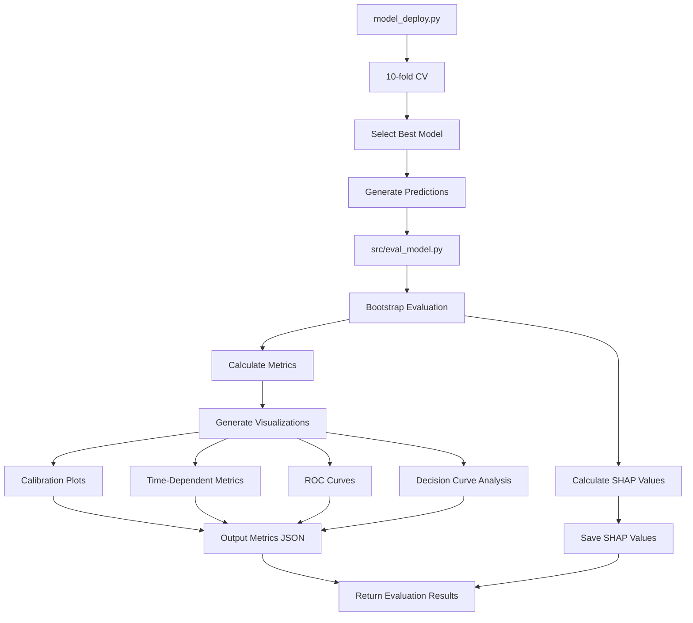

# Comprehensive Redesign Plan for Model Evaluation Process

Based on the codebase analysis and requirements, this document outlines the detailed plan to redesign the model evaluation process. This plan integrates evaluation directly into the model deployment step, implements bootstrap evaluation, adds SHAP value analysis, and includes additional visualizations.

## Architecture Overview



## Implementation Plan

### 1. Create `src/eval_model.py`

This new module will contain all evaluation functionality:

```python
def evaluate_model(model, datasets, n_bootstrap=500, time_horizons=None, output_dir=None, save_predictions=True):
    """
    Evaluate a survival model using bootstrap to estimate confidence intervals.
    
    Args:
        model: The trained survival model (DeepSurv or DeepHit)
        datasets: Dictionary of datasets to evaluate (training, temporal_test, spatial_test)
        n_bootstrap: Number of bootstrap iterations (default: 500)
        time_horizons: List of time horizons for evaluation (default: [365, 730, 1095, 1460, 1825])
        output_dir: Directory to save results (default: None)
        save_predictions: Whether to save predictions to CSV files (default: True)
        
    Returns:
        Dictionary of evaluation results for each dataset
    """
    # Implementation details...

def calculate_metrics(model, x, durations, events, time_horizons, n_bootstrap=500):
    """
    Calculate survival metrics with bootstrap confidence intervals.
    
    Args:
        model: The trained survival model
        x: Feature matrix
        durations: Event times
        events: Event indicators
        time_horizons: List of time horizons
        n_bootstrap: Number of bootstrap iterations
        
    Returns:
        Dictionary of metrics with confidence intervals
    """
    # Implementation details...

def calculate_shap_values(model, x, n_bootstrap=500):
    """
    Calculate SHAP values for feature importance with bootstrap.
    
    Args:
        model: The trained survival model
        x: Feature matrix
        n_bootstrap: Number of bootstrap iterations
        
    Returns:
        Dictionary of SHAP values with confidence intervals
    """
    # Implementation details...

def create_visualizations(results, dataset_name, output_dir):
    """
    Create visualizations for model performance.
    
    Args:
        results: Evaluation results
        dataset_name: Name of the dataset
        output_dir: Directory to save visualizations
        
    Returns:
        Dictionary of paths to saved visualizations
    """
    # Implementation details...

def create_roc_curve(datasets_results, model_type, time_horizons, output_dir):
    """
    Create ROC curve for all datasets on the same plot.
    
    Args:
        datasets_results: Dictionary of results for all datasets
        model_type: Type of model (DeepSurv or DeepHit)
        time_horizons: List of time horizons
        output_dir: Directory to save visualizations
        
    Returns:
        Path to saved ROC curve plot
    """
    # Implementation details...

def create_decision_curve_analysis(datasets_results, model_type, time_horizons, output_dir):
    """
    Create decision curve analysis for the model.
    
    Args:
        datasets_results: Dictionary of results for all datasets
        model_type: Type of model (DeepSurv or DeepHit)
        time_horizons: List of time horizons
        output_dir: Directory to save visualizations
        
    Returns:
        Dictionary of paths to saved decision curve plots
    """
    # Implementation details...

def save_results(results, output_dir):
    """
    Save evaluation results to JSON files.
    
    Args:
        results: Evaluation results
        output_dir: Directory to save results
        
    Returns:
        Dictionary of paths to saved files
    """
    # Implementation details...

def save_predictions(surv, durations, events, dataset_name, output_dir):
    """
    Save survival predictions to CSV files.
    
    Args:
        surv: Survival predictions DataFrame
        durations: Event times
        events: Event indicators
        dataset_name: Name of the dataset
        output_dir: Directory to save predictions
        
    Returns:
        Dictionary of paths to saved files
    """
    # Implementation details...

def save_shap_values(shap_values, feature_names, dataset_name, output_dir):
    """
    Save SHAP values to CSV/JSON files.
    
    Args:
        shap_values: SHAP values with bootstrap samples
        feature_names: Names of features
        dataset_name: Name of the dataset
        output_dir: Directory to save SHAP values
        
    Returns:
        Path to saved file
    """
    # Implementation details...
```

### 2. Modify `steps/model_deploy.py`

The key changes to `model_deploy.py` will be:

```python
# Import the new evaluation module
from src.eval_model import evaluate_model, save_predictions

# After selecting the best model
model = best_fold_model

# Prepare datasets for evaluation
datasets = {
    'training': {
        'x': x_train,
        'durations': durations_train,
        'events': events_train,
        'feature_names': feature_cols
    }
}

# Add test datasets if available
if temporal_test_df_preprocessed is not None:
    # Prepare temporal test dataset
    # ...
    datasets['temporal_test'] = {
        'x': x_temporal_test,
        'durations': durations_temporal_test,
        'events': events_temporal_test,
        'feature_names': feature_cols
    }

if spatial_test_df_preprocessed is not None:
    # Prepare spatial test dataset
    # ...
    datasets['spatial_test'] = {
        'x': x_spatial_test,
        'durations': durations_spatial_test,
        'events': events_spatial_test,
        'feature_names': feature_cols
    }

# Evaluate model
evaluation_results = evaluate_model(
    model=model,
    datasets=datasets,
    n_bootstrap=500,
    time_horizons=time_grid,
    output_dir="results/model_evaluation",
    save_predictions=True
)

# Include evaluation results in the return value
return {
    'model': model,
    'model_type': model_type,
    'evaluation_results': evaluation_results,
    # Other details...
}
```

### 3. Update Training Pipeline

Modify `pipelines/training_pipeline.py` to remove the model_eval step:

```python
# Remove this import
# from steps.model_eval import eval_model

# Remove the eval_model step
# evaluation_results = eval_model(
#     deployed_model_details=deployed_model_details,
#     train_df=train_df_preprocessed,
#     temporal_test_df=temporal_test_df_preprocessed,
#     spatial_test_df=spatial_test_df_preprocessed
# )

# Update the return value to use the evaluation results from deploy_model
return {
    "model_type": model_type,
    # "model_details": model_details,
    # "optimization_metrics": optimization_metrics,
    "deployed_model_details": deployed_model_details,
    # "evaluation_results": evaluation_results,  # This line is removed
    "feature_selection_results": feature_selection_results,
    "kfre_results": kfre_results,
    "eda_results": eda_results
}
```

## Technical Implementation Details

### Bootstrap Evaluation Process

1. For each dataset (training, temporal_test, spatial_test):
   - Perform n_bootstrap iterations (default: 500)
   - For each iteration:
     - Sample with replacement from the dataset
     - Calculate metrics (C-index, Brier score, log-likelihood) on the sampled data
     - Calculate SHAP values for each feature on the sampled data
   - Calculate mean and confidence intervals for each metric
   - Calculate mean and confidence intervals for SHAP values

### SHAP Value Calculation

For survival models, SHAP values will be calculated using the `shap` library:

```python
import shap

def calculate_shap_values(model, x, feature_names, n_bootstrap=500):
    # Create a background dataset for SHAP
    background = shap.sample(x, 100)
    
    # Create an explainer
    explainer = shap.DeepExplainer(model.net, background)
    
    # Initialize array for bootstrap SHAP values
    all_shap_values = []
    
    # Perform bootstrap
    for i in range(n_bootstrap):
        # Sample with replacement
        indices = np.random.choice(len(x), size=len(x), replace=True)
        x_sample = x[indices]
        
        # Calculate SHAP values
        shap_values = explainer.shap_values(x_sample)
        
        # Store mean absolute SHAP value for each feature
        feature_importance = np.abs(shap_values).mean(axis=0)
        all_shap_values.append(feature_importance)
    
    # Convert to numpy array
    all_shap_values = np.array(all_shap_values)
    
    # Calculate mean and confidence intervals
    mean_shap = np.mean(all_shap_values, axis=0)
    lower_ci = np.percentile(all_shap_values, 2.5, axis=0)
    upper_ci = np.percentile(all_shap_values, 97.5, axis=0)
    
    # Create result dictionary
    result = {
        'feature_names': feature_names,
        'mean_shap': mean_shap.tolist(),
        'lower_ci': lower_ci.tolist(),
        'upper_ci': upper_ci.tolist(),
        'all_bootstrap_values': all_shap_values.tolist()
    }
    
    return result
```

### ROC Curve Implementation

The ROC curve will combine all datasets (training, temporal_test, spatial_test) on the same plot:

```python
def create_roc_curve(datasets_results, model_type, time_horizons, output_dir):
    """
    Create ROC curve for all datasets on the same plot.
    """
    import matplotlib.pyplot as plt
    from sklearn.metrics import roc_curve, auc
    import numpy as np
    from datetime import datetime
    
    # Create figure
    plt.figure(figsize=(12, 8))
    
    # Colors and markers for different datasets
    colors = {'training': 'blue', 'temporal_test': 'red', 'spatial_test': 'green'}
    markers = {'training': 'o', 'temporal_test': 's', 'spatial_test': '^'}
    
    # For each time horizon
    for time_horizon in time_horizons:
        plt.figure(figsize=(12, 8))
        
        # For each dataset
        for dataset_name, results in datasets_results.items():
            if results is None:
                continue
                
            # Get predictions and true values for this time horizon
            try:
                # Find the closest time point in the predictions
                surv = results['predictions']
                durations = results['durations']
                events = results['events']
                
                # For DeepSurv/DeepHit with DataFrame output
                closest_time = min(surv.columns, key=lambda x: abs(float(x) - time_horizon))
                risk_scores = 1 - surv[closest_time].values
                
                # Create binary outcome indicator (event occurred before or at time_horizon)
                outcome = (durations <= time_horizon) & (events == 1)
                
                # Calculate ROC curve
                fpr, tpr, _ = roc_curve(outcome, risk_scores)
                roc_auc = auc(fpr, tpr)
                
                # Plot ROC curve
                plt.plot(fpr, tpr, color=colors[dataset_name], marker=markers[dataset_name], 
                         label=f'{dataset_name} (AUC = {roc_auc:.3f})', 
                         markevery=0.1, markersize=8, linewidth=2)
                
            except Exception as e:
                print(f"Error creating ROC curve for {dataset_name} at {time_horizon} days: {e}")
        
        # Add diagonal line
        plt.plot([0, 1], [0, 1], 'k--', linewidth=1)
        
        # Set labels and title
        plt.xlabel('False Positive Rate', fontsize=14)
        plt.ylabel('True Positive Rate', fontsize=14)
        plt.title(f'ROC Curve at {time_horizon} Days', fontsize=16)
        
        # Add legend
        plt.legend(loc='lower right', fontsize=12)
        
        # Add grid
        plt.grid(True, linestyle='--', alpha=0.7)
        
        # Save figure
        timestamp = datetime.now().strftime("%Y%m%d_%H%M%S")
        plot_path = f'{output_dir}/roc_curve_{time_horizon}days_{timestamp}.png'
        plt.savefig(plot_path, dpi=300, bbox_inches='tight')
        plt.close()
    
    return plot_path
```

### Decision Curve Analysis Implementation

The decision curve analysis will be implemented for each endpoint:

```python
def create_decision_curve_analysis(datasets_results, model_type, time_horizons, output_dir):
    """
    Create decision curve analysis for the model.
    """
    import matplotlib.pyplot as plt
    import numpy as np
    from datetime import datetime
    
    # Dictionary to store paths to saved plots
    plot_paths = {}
    
    # For DeepSurv, there's only one endpoint
    if model_type.lower() == "deepsurv":
        endpoints = [1]  # Assuming endpoint 1 is the target
    else:  # For DeepHit, there can be multiple endpoints
        # Get the number of endpoints from the events data
        # This assumes events is a 2D array for DeepHit with shape (n_samples, n_endpoints)
        sample_events = next(iter(datasets_results.values()))['events']
        if isinstance(sample_events, np.ndarray) and sample_events.ndim > 1:
            endpoints = list(range(1, sample_events.shape[1] + 1))
        else:
            endpoints = [1]  # Default to one endpoint if can't determine
    
    # For each endpoint
    for endpoint in endpoints:
        # For each time horizon
        for time_horizon in time_horizons:
            plt.figure(figsize=(12, 8))
            
            # Threshold probabilities to evaluate
            threshold_probs = np.arange(0, 1.01, 0.01)
            
            # Store net benefit for each dataset
            net_benefits = {}
            
            # For each dataset
            for dataset_name, results in datasets_results.items():
                if results is None:
                    continue
                    
                try:
                    # Get predictions and true values for this time horizon
                    surv = results['predictions']
                    durations = results['durations']
                    events = results['events']
                    
                    # Find the closest time point in the predictions
                    closest_time = min(surv.columns, key=lambda x: abs(float(x) - time_horizon))
                    risk_scores = 1 - surv[closest_time].values
                    
                    # Create binary outcome indicator (event occurred before or at time_horizon)
                    if model_type.lower() == "deepsurv":
                        outcome = (durations <= time_horizon) & (events == 1)
                    else:  # For DeepHit with multiple endpoints
                        # This assumes events is a 2D array for DeepHit
                        if events.ndim > 1:
                            outcome = (durations <= time_horizon) & (events[:, endpoint-1] == 1)
                        else:
                            outcome = (durations <= time_horizon) & (events == endpoint)
                    
                    # Calculate net benefit for each threshold probability
                    net_benefit = []
                    for p in threshold_probs:
                        # Convert probability to threshold
                        threshold = p
                        
                        # Classify patients based on threshold
                        predicted_positive = risk_scores >= threshold
                        
                        # Calculate true positives and false positives
                        tp = np.sum(predicted_positive & outcome)
                        fp = np.sum(predicted_positive & ~outcome)
                        
                        # Calculate net benefit
                        n = len(outcome)
                        if np.sum(predicted_positive) > 0:
                            nb = (tp/n) - (fp/n) * (p/(1-p))
                        else:
                            nb = 0
                        
                        net_benefit.append(nb)
                    
                    # Store net benefit for this dataset
                    net_benefits[dataset_name] = net_benefit
                    
                    # Plot decision curve
                    plt.plot(threshold_probs, net_benefit, 
                             label=f'{dataset_name}', 
                             linewidth=2)
                    
                except Exception as e:
                    print(f"Error creating decision curve for {dataset_name} at {time_horizon} days: {e}")
            
            # Add "treat all" and "treat none" lines
            # "Treat all" line
            treat_all = []
            for p in threshold_probs:
                # Calculate net benefit of treating all patients
                event_rate = np.mean([np.mean((results['durations'] <= time_horizon) & (results['events'] == 1)) 
                                     for results in datasets_results.values() if results is not None])
                nb_all = event_rate - (1 - event_rate) * (p/(1-p))
                treat_all.append(max(0, nb_all))
            
            plt.plot(threshold_probs, treat_all, 'k--', label='Treat All', linewidth=1)
            
            # "Treat none" line
            plt.plot(threshold_probs, [0] * len(threshold_probs), 'k-', label='Treat None', linewidth=1)
            
            # Set labels and title
            plt.xlabel('Threshold Probability', fontsize=14)
            plt.ylabel('Net Benefit', fontsize=14)
            if model_type.lower() == "deepsurv":
                plt.title(f'Decision Curve Analysis at {time_horizon} Days', fontsize=16)
            else:
                plt.title(f'Decision Curve Analysis for Endpoint {endpoint} at {time_horizon} Days', fontsize=16)
            
            # Add legend
            plt.legend(loc='lower left', fontsize=12)
            
            # Add grid
            plt.grid(True, linestyle='--', alpha=0.7)
            
            # Save figure
            timestamp = datetime.now().strftime("%Y%m%d_%H%M%S")
            if model_type.lower() == "deepsurv":
                plot_path = f'{output_dir}/decision_curve_{time_horizon}days_{timestamp}.png'
            else:
                plot_path = f'{output_dir}/decision_curve_endpoint{endpoint}_{time_horizon}days_{timestamp}.png'
            
            plt.savefig(plot_path, dpi=300, bbox_inches='tight')
            plt.close()
            
            # Store path to saved plot
            if endpoint not in plot_paths:
                plot_paths[endpoint] = {}
            plot_paths[endpoint][time_horizon] = plot_path
    
    return plot_paths
```

### Output Files

The evaluation process will generate the following files:

1. **Metrics JSON files**:
   - `{dataset_name}_metrics_{timestamp}.json` - Contains all metrics with confidence intervals

2. **SHAP values files**:
   - `{dataset_name}_shap_values_{timestamp}.json` - Contains SHAP values with confidence intervals
   - `{dataset_name}_shap_values_{timestamp}.csv` - CSV format for easier analysis

3. **Prediction files**:
   - `{dataset_name}_predictions_{timestamp}.csv` - Survival predictions
   - `{dataset_name}_metadata_{timestamp}.csv` - Event times and indicators

4. **Visualization files**:
   - `{dataset_name}_calibration_plot_{timestamp}.png` - Calibration plots
   - `{dataset_name}_metrics_by_time_{timestamp}.png` - Time-dependent metrics
   - `roc_curve_{time_horizon}days_{timestamp}.png` - ROC curves for all datasets
   - `decision_curve_{time_horizon}days_{timestamp}.png` - Decision curve analysis (DeepSurv)
   - `decision_curve_endpoint{endpoint}_{time_horizon}days_{timestamp}.png` - Decision curve analysis (DeepHit)

## Next Steps

1. Create the `src/eval_model.py` module with all the functions described above
2. Modify `steps/model_deploy.py` to use the new evaluation module
3. Update `pipelines/training_pipeline.py` to remove the model_eval step
4. Test the implementation with both DeepSurv and DeepHit models
5. Verify that all output files are generated correctly