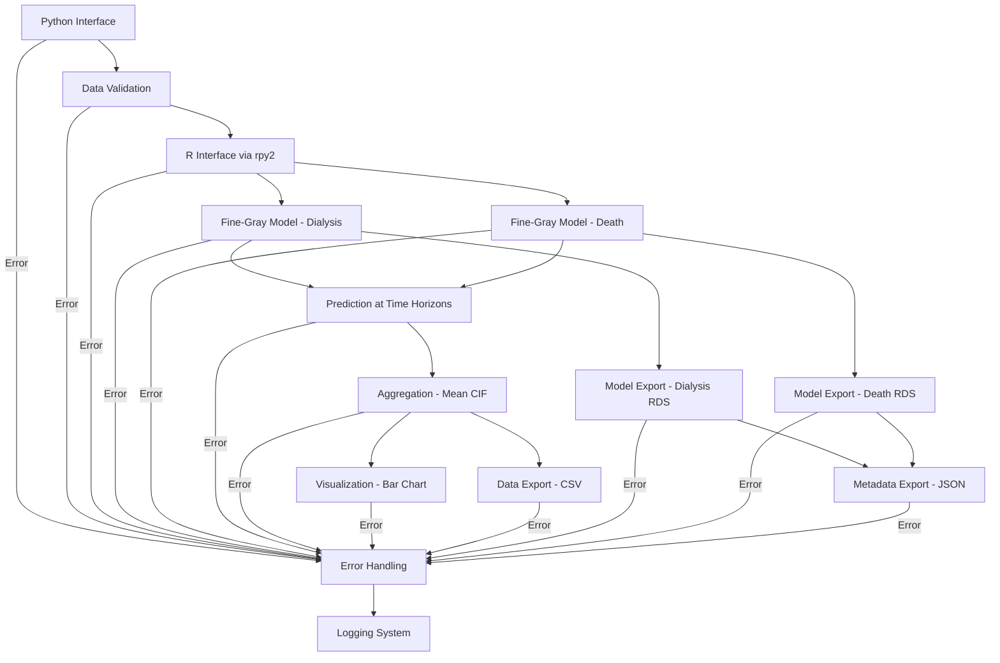

# Implementation Plan for r_fine_gray.py

## 1. Module Overview

The `r_fine_gray.py` module will implement a baseline competing-risk dashboard for CKD dialysis and mortality using Fine-Gray models. It will provide an instant descriptive overview of a CKD cohort's observed risk of starting dialysis and all-cause mortality at 1-, 2-, 3-, 4-, and 5-year horizons.

## 2. Architecture



## 3. Key Components

### 3.1 Python Interface

```python
def run_baseline_cif(df, feature_cols=None, output_path="./output", seed=42, n_threads=None, silent=False):
    """
    Main function to run the baseline competing-risk Fine-Gray analysis.
    
    Args:
        df (pd.DataFrame): Input dataframe with duration, endpoint, and feature columns
        feature_cols (list, optional): List of feature column names. If None, uses default from YAML.
        output_path (str, optional): Path to save outputs. Defaults to "./output".
        seed (int, optional): Random seed for reproducibility. Defaults to 42.
        n_threads (int, optional): Number of threads to use. If None, respects env vars or auto-detects.
        silent (bool, optional): Whether to suppress progress logs. Defaults to False.
        
    Returns:
        dict: Dictionary containing results (risks at each horizon for dialysis and death)
    """
```

### 3.2 Data Validation

- Validate input dataframe structure
- Check for required columns (duration, endpoint)
- Handle missing values (drop rows with missing values in required columns)
- Report number of rows dropped due to missing values
- Validate feature columns
- Validate data types and convert if necessary
- Check for negative durations or invalid endpoint values

### 3.3 R Interface via rpy2

- Initialize R environment
- Set up thread control (respect OMP_NUM_THREADS, MKL_NUM_THREADS)
- Import required R packages (fastcmprsk, ggplot2)
- Convert Python dataframe to R dataframe
- Set up R random seed for reproducibility

### 3.4 Fine-Gray Model Fitting

- Fit Fine-Gray model for dialysis (endpoint = 1)
- Fit Fine-Gray model for death (endpoint = 2)
- Use fastCrr() with bootstrap variance (B = 200)
- Handle model fitting errors gracefully

### 3.5 Prediction at Time Horizons

- Define time horizons: 365, 730, 1095, 1460, 1825 days (1-5 years)
- Use predict() to obtain CIF at each horizon for all rows
- Handle prediction errors gracefully

### 3.6 Aggregation

- Calculate mean CIF across rows for each endpoint and horizon
- Convert to risk percentages

### 3.7 Visualization

- Create bar chart with ggplot2
- Two bars per horizon (dialysis/death)
- Y-axis showing risk percentage
- Annotate exact values
- Export as PNG

### 3.8 Data Export

- Export results as CSV (columns: horizon_days, dialysis_pct, death_pct)

### 3.9 Model Export

- Create models directory if it doesn't exist
- Save dialysis model using saveRDS()
- Save death model using saveRDS()
- Use compression="xz"

### 3.10 Metadata Export

- Create JSON with:
  - Seed value
  - R version
  - Package versions
  - Date-time
  - Row/feature counts
  - MD5 checksums of model files

### 3.11 Model Loading Functionality

- Function to load saved models for later use
- Function to predict on new data using loaded models

## 4. Implementation Details

### 4.1 Required R Packages

- fastcmprsk: For Fine-Gray model fitting
- ggplot2: For visualization
- jsonlite: For JSON export
- tools: For MD5 checksums

### 4.2 Thread Control

- Respect environment variables if set
- Allow explicit thread count via function parameter
- Auto-detect if neither is specified (use n_cores - 1)

### 4.3 Error Handling and Logging

#### 4.3.1 Enhanced Error Handling

- **R-Python Interoperability Errors**
  - Catch and handle rpy2 initialization errors
  - Handle R package loading failures with specific error messages
  - Implement fallback mechanisms for R function calls
  - Validate R object types before operations
  - Handle R exceptions with detailed error messages
  - Implement timeout mechanism for long-running R operations

- **Data Conversion Errors**
  - Handle data type conversion errors between Python and R
  - Validate data structure after conversion
  - Implement recovery mechanisms for partial conversion failures

- **Model Fitting Errors**
  - Handle convergence issues in Fine-Gray model
  - Detect and report singularity problems
  - Implement fallback to simpler models if necessary
  - Handle bootstrap variance estimation failures

- **File System Errors**
  - Handle permission issues when writing outputs
  - Validate file paths before operations
  - Implement retry mechanisms for transient file system errors

#### 4.3.2 Comprehensive Logging System

- **Log Levels**
  - DEBUG: Detailed debugging information
  - INFO: General information about progress
  - WARNING: Warning messages
  - ERROR: Error messages
  - CRITICAL: Critical errors that prevent execution

- **Log Components**
  - Timestamp
  - Log level
  - Component name
  - Message
  - Context information (when applicable)
  - Exception details (when applicable)

- **Progress Logging**
  - Log progress every 10 seconds during long operations
  - Include percentage completion when possible
  - Report current operation and remaining time estimate

- **R Operation Logging**
  - Capture R console output and warnings
  - Log R errors with Python context
  - Track R memory usage for debugging

- **Silent Mode**
  - Option to suppress all but ERROR and CRITICAL logs
  - Still write logs to file even in silent mode

### 4.4 Performance Monitoring

- Track execution time of key operations
- Monitor memory usage
- Report performance metrics in logs and metadata

## 5. Code Structure

The module will be structured as follows:

1. Imports and setup
2. Logger configuration
3. Error handling utilities
4. R interface utilities
5. Data validation functions
6. Model fitting functions
7. Prediction functions
8. Visualization functions
9. Export functions
10. Model loading functions
11. Main function (run_baseline_cif)
12. Additional utility functions

## 6. Testing Strategy

1. Unit tests for individual components
2. Integration test with sample data
3. Performance test with large dataset (10k patients, 15 features)
4. Reproducibility test (same seed → identical results)
5. Error handling tests with invalid inputs
6. R interoperability tests with different R versions

## 7. Implementation Timeline

1. Day 1: Set up R interface, logging system, and data validation
2. Day 2: Implement model fitting, error handling, and prediction
3. Day 3: Implement aggregation and visualization
4. Day 4: Implement data and model export
5. Day 5: Implement model loading and metadata export
6. Day 6: Testing and performance optimization
7. Day 7: Documentation and finalization

## 8. Potential Challenges and Mitigations

1. **R Package Dependencies**
   - Challenge: Required R packages might not be installed
   - Mitigation: Add package installation check and auto-install if missing
   - Error Handling: Provide clear error messages with installation instructions

2. **Performance with Large Datasets**
   - Challenge: Slow performance with large datasets
   - Mitigation: Optimize thread control and memory usage
   - Monitoring: Log memory usage and execution time for diagnostics

3. **rpy2 Compatibility**
   - Challenge: rpy2 version compatibility issues
   - Mitigation: Document required versions and provide fallback options
   - Error Handling: Detect version mismatches and provide specific guidance

4. **Model File Size**
   - Challenge: Large model files might clog Git
   - Mitigation: Use compression and document Git LFS usage
   - Monitoring: Track and log file sizes

5. **R-Python Data Type Conversion**
   - Challenge: Data type mismatches between R and Python
   - Mitigation: Implement robust type checking and conversion
   - Error Handling: Provide detailed error messages for conversion failures

6. **R Process Crashes**
   - Challenge: R process might crash during computation
   - Mitigation: Implement process monitoring and restart capability
   - Error Handling: Capture crash information for debugging